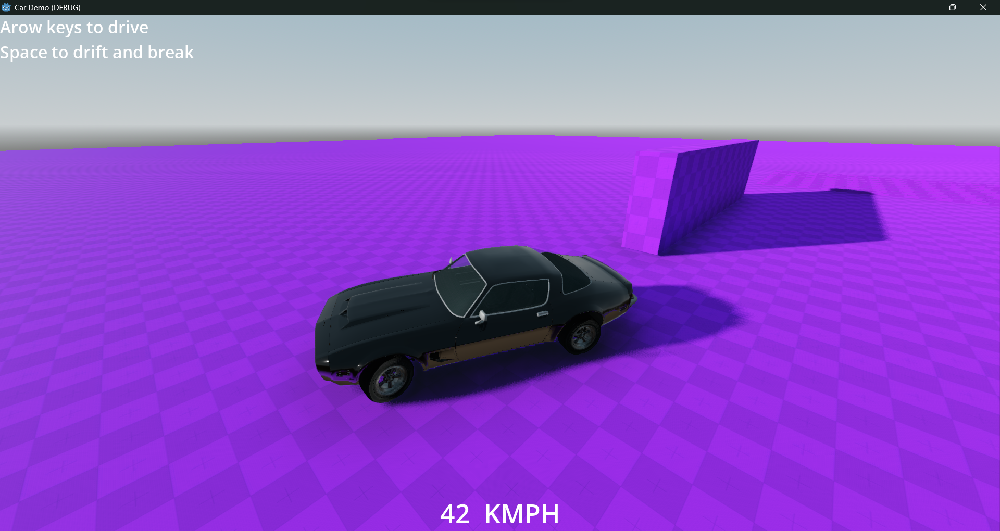
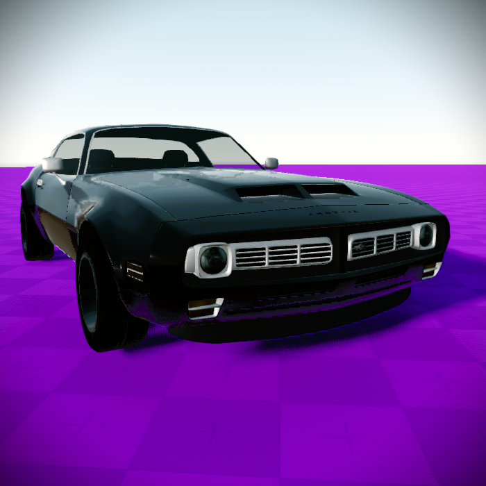

# Car-Demo

A simple Godot 4 demo focused on building and driving modular car setups.

## Overview

Car-Demo is a lightweight learning project for vehicle gameplay in Godot. It includes a reusable base car setup, a follow camera, and scene examples that make it easier to prototype your own vehicle variations.

## Features

- Playable base car controller
- Dynamic follow camera system
- GLTF-based car and wheel model workflow
- Inheritance-friendly scene structure for rapid variants
- Extra environment elements (spinning and bobbing platforms) for testing

## Project Structure

- `cars/` contains car scenes, models, and camera logic
- `Scripts/` contains reusable gameplay scripts (reset, spinning, bobbing)
- `Scenes/` contains test and environment scenes

## Getting Started

1. Open the project in Godot 4.
2. Load `main.tscn` and run the project.
3. Duplicate or inherit from `cars/BaseCar.tscn` to create your own car variants.

## Credits

- **Project Creator:** Manik Sharma
- **Contributors:**
  - ShadowDara
  - Weasel On A Stick
